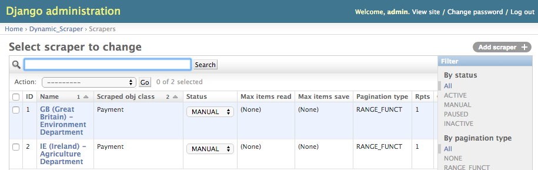

====================
Scraper (Django/DDS)
====================

Introduction
------------

The scraping infrastructure is build on ``Python/Django`` and is using the
`djang-dynamic-scraper <https://github.com/holgerd77/django-dynamic-scraper>`_
scraping library at its core.

Scrapers for the various EU member state agencies databases are build and maintained
within the Django admin interface.

Installation
------------

The scraping infrastructure project can be installed by cloning the 
`GitHub <https://github.com/holgerd77/openfarmsubsidies>`__ repository and 
install the requirements into a ``Python 3.5`` virtualenv with::

    pip install -r requirements.txt
    pip install -r requirements_dev.txt # DEV requirements

The project uses the following main ``Python/Django`` libraries:

* `Django 1.10 <https://www.djangoproject.com/>`_
* `Scrapy 1.3 <http://scrapy.org/>`_
* `Django Dynamic Scraper (DDS) 0.11 <django-dynamic-scraper.readthedocs.org/en/latest/>`_

Configuration
-------------

The following environment variables have to be found in your shell environment,
e.g. by adding lines like ``export OPENFARMSUBSIDIES_SECRET_KEY="..."`` to the
``.bash_profile`` file:

+-------------------------------+-----------------------------------------------+--------------------+
| Key                           | Description                                   | Place              |
+===============================+===============================================+====================+
|``OPENFARMSUBSIDIES_SECRET_KEY`` | Project specific Django secret key          | ``settings.py``    |
+-------------------------------+-----------------------------------------------+--------------------+

Starting a local Django server should now provide access to the scraper management
admin console via the browser (go to ``127.0.0.1:8000``)::

    python manage.py runserver

Scraper Handling
----------------

Importing/exporting Scrapers
^^^^^^^^^^^^^^^^^^^^^^^^^^^^

Scrapers can be found in the ``scraper_dumps`` directory inside the repository and imported
with the following command::

    python manage.py loaddata scraper_dumps/farmsubsidy_scraper_dump_YYYY-MM-DD_dds_[DDS_VERSION_NUMBER].json #Generic
    python manage.py loaddata scraper_dumps/farmsubsidy_scraper_dump_2016-01-18_dds_v094.json #Example

.. note::
   It is recommended to match the project installation DDS version with the version from the scraper
   dump, otherwise DB changes during DDS version changes have to be looked at closely in the
   `DDS release notes <http://django-dynamic-scraper.readthedocs.org/en/latest/development.html#releasenotes>`_
   and manual adoptions to the JSON dump format might be necessary.

Creating a new Scraper
^^^^^^^^^^^^^^^^^^^^^^

For creating scrapers a ``ScrapedObjectClass`` ``Payment`` has to be defined in the Django admin in addition
to the ``models.py`` definition, defining the data structure of the scraped payment data.

Scrapers are created per-country wise as ``Scraper`` objects in the Django admin and are referenced in additional
``Country`` objects, representing a EU member states respectively the associated payments agency.

For further documentation and conceptional overview see the 
`DDS docs <http://django-dynamic-scraper.readthedocs.org/en/>`_

Running a Scraper
^^^^^^^^^^^^^^^^^

Scraper can be run from the command line with the following command::

    scrapy crawl --output=data.json --output-format=jsonlines payment_spider -L DEBUG -a id=GB -a max_items_read=4 -a max_pages_read=2

This will run the scraper connected to the ``Agency`` in the Django admin with the id ``GB`` and
write the output in a ``JSON Lines`` formatted file called ``data.json``.

Usage options for scraping behaviour can be found in the corresponding  DDS doc section for
`running/testing scrapers <http://django-dynamic-scraper.readthedocs.org/en/latest/getting_started.html#running-testing-your-scraper>`_.

Data Format
-----------

Format Description
^^^^^^^^^^^^^^^^^^

Scraped items are saved with additional serialization customizations defined in the ``models.py`` module
as ``JSON Lines`` items, more or less (one additional processing is necessary) ready to be indexed in the
``Elastic`` index.

If currency is scraped in national unit conversion rate and date is read from `fixer.io <http://fixer.io/>`_ API.

Data format looks like the following::

    {
      "town": "PERTH",
      "amount_nc": 57444.0,
      "name": "\"A F Angelil T/A \"\"Cluny Estate\"\"\"",
      "amount_euro": 76126.11,
      "country": "GB",
      "sub_payments_euro": [{
        "amount": 32969.45,
        "name": "Rural Development"
      }, {
        "amount": 43156.83,
        "name": "Direct Aid"
      }, {
        "amount": 0.0,
        "name": "Market Schemes"
      }],
      "sub_payments_nc": [{
        "amount": 24878.42,
        "name": "Rural Development"
      }, {
        "amount": 32565.71,
        "name": "Direct Aid"
      }, {
        "amount": 0.0,
        "name": "Market Schemes"
      }],
      "year": 2015,
      "nc_conv_rate": 0.75459,
      "nc_conv_date": "2016-01-22",
      "zip_code": "PH2"
    }

Recipient Name Translation
^^^^^^^^^^^^^^^^^^^^^^^^^^

For recipient name translation the ``Yandex`` translation API is used.
``YANDEX_TRANSLATE_API_ENDPOINT`` and ``YANDEX_TRANSLATE_API_KEY`` have to be 
set in ``settings.py`` file.

Translation is automatically activated if ``name_en`` attribute is added to a 
scraper of a specific country, leave attribute for scrapers with no translation
(e.g. ``GB``).

Yandex has the current API limits:

* 1.000.000 characters per day
* 10.000.000 characters per month

``OpenFarmsubsidies`` scraping is coming close, so API usage has to be actively
managed/recorded to avoid reaching limitations.

Take the following formula for character estimates:

* (Number of recipients (``wc -l``)) * 15 characters/recipient

Try to stay under 80% of day/month limit, distribute (translated) scraper runs to different
days, avoid double runs.

Creating the Countries Endpoint
-------------------------------

The ``countries`` endpoint of the API (see: :ref:`countries_endpoint`) is taking the
administrated data from the ``Country`` Django model objects as a starting point.

There is a ``create_countries_endpoint`` Django management command providing the
``JSON`` output for the API response::

  python manage.py create_countries_endpoint

Recreate the API endpoint every time a country is added and integrate it in the 
Backend/API python code.

